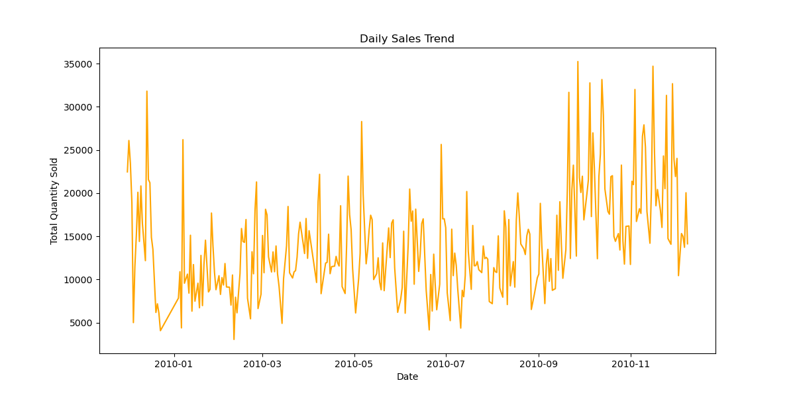
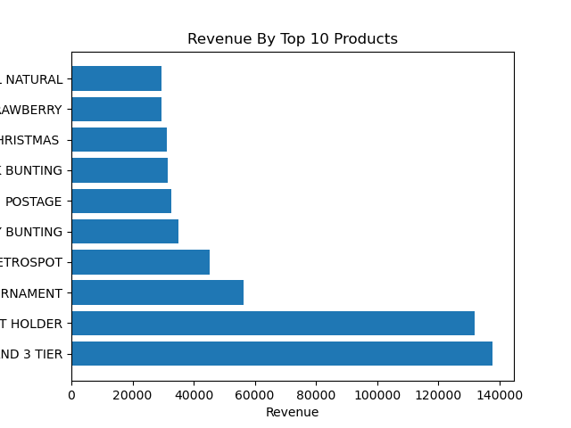
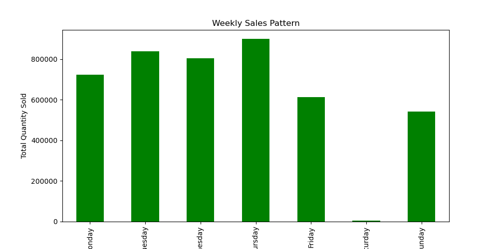
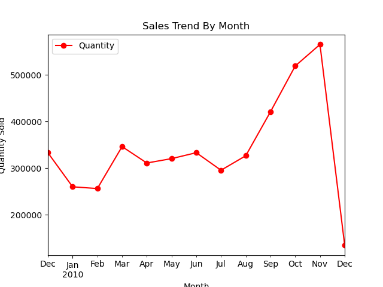
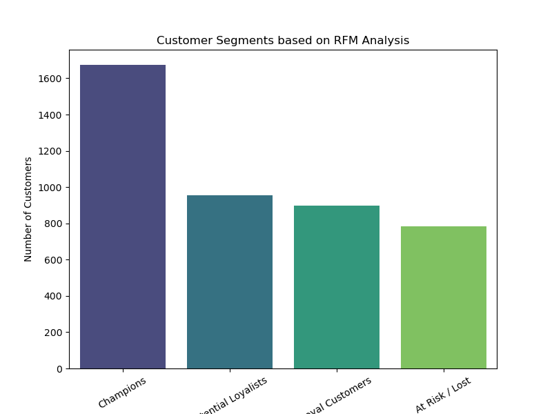

# 🛒 Online Retail Dataset Analysis

## 📌 Overview
This project analyzes an **Online Retail dataset** to extract insights about sales, customers, products, and countries.  
The analysis includes **data cleaning, exploratory data analysis (EDA), customer segmentation (RFM)**, and visualization.


---

## ⚙️ Tools & Technologies
- Python (Pandas, NumPy, Matplotlib, Seaborn)
- Jupyter Notebook
- Excel
- RFM Segmentation

---

## 📊 Key Insights
- Total number of transactions and unique customers.
- Top 10 selling products by quantity and revenue.
- Country-wise sales distribution (UK dominates sales).
- Revenue comparison across countries.
- Customer segmentation using **Recency, Frequency, Monetary (RFM)**.

---

## 📸 Visualizations
-
- **Daily Sales Trendd**  
    

- **Monthly Sales Trends Bar Plot**  
  
  
- **Weekly Sales Pattern**  
  
  
- **Top 10 Products by Quantity Sold**  
  

- **Top 10 Loyal Customers (Most Orders)**  
  .png)   

- **Monthly Sales Trends**  
    

- **RFM Segmentation**  
    

---

## 🚀 How to Run
1. Clone the repository  
   ```bash
   git clone https://github.com/YourUsername/Online-Retail-EDA.git
   cd Online-Retail-EDA
